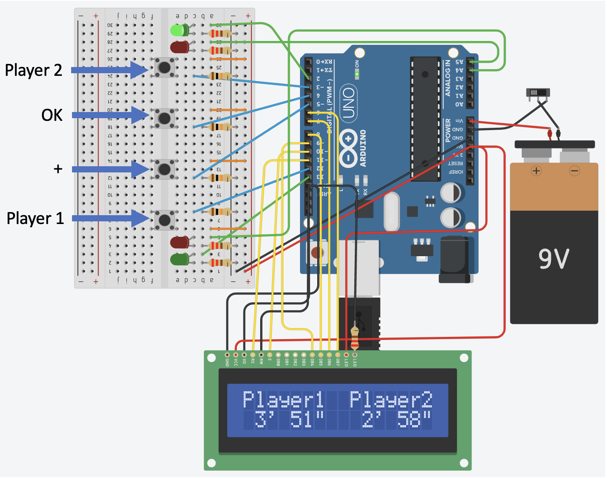

# chess_clock

Project for chess clock based on Arduino micro-controller. The simulation can be done on Tinkercad: https://www.tinkercad.com/things/5wPtXyiBjtW-chessclock?sharecode=kqfbViBHTqU0ywpIeZdrtAZjeGuyt6cCd1n48N4d95I

